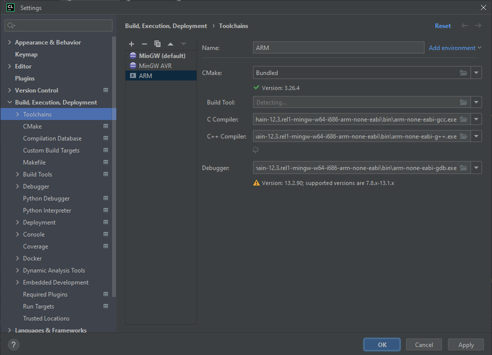
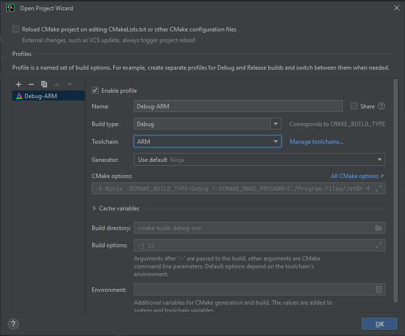
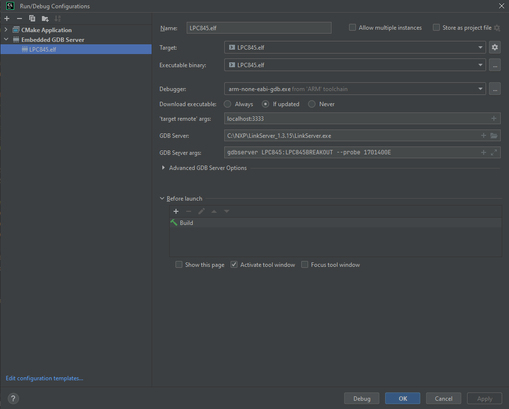
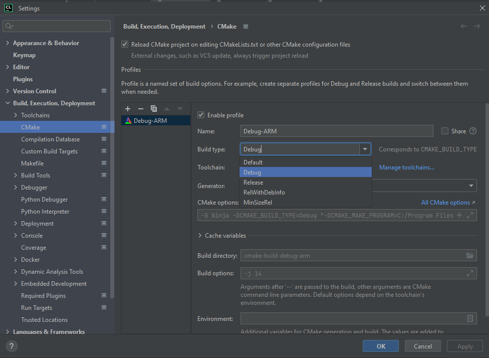

# LPC-on-Clion

An example LPC845 configuration for Clion

### Information about the project

This has a super simple blink example with an LCP845, it's main purpouse is to share this configuration with the
community.

#### Prerequisites:

- Install [ARM GNU toolchain](https://developer.arm.com/Tools%20and%20Software/GNU%20Toolchain)
- Configure Clion's toolchain for ARM as a "system"
  toolchain ([CLion's guide](https://www.jetbrains.com/help/clion/how-to-create-toolchain-in-clion.html#env-scripts))
  you just need to select the compilers and debugger:
  
- Download and install LinkServer from
  [here](https://www.nxp.com/design/software/development-software/mcuxpresso-software-and-tools-/linkserver-for-microcontrollers:LINKERSERVER)

### How to compile using this repo

When project gets opened for the first time you need to set up ARM toolchain.

If you have an LPC845 board, you can clone this repository and open it with Clion. If not, you can follow the guide on
how to configure it for your own NXP board.

- Clone this repository
- Modify the CMakeLists.txt with preprocessor definitions and compiler and linker flags you can get by copying from a
  simple MCUXpresso project
- Create a “ARM GCC / MCUXpresso for VS Code” SDK in [NXP's SDK builder](https://mcuxpresso.nxp.com/en/select) and
  download an example project inside that project copy the equivalent files for the ones this project has on "firmware"
  directory(except for `LPC845.svd`)

Disclaimer: Inside CMakeLists.txt there is a variable called "MCU_DEVICE" which is used for both linker script name and
also for flashing target, have this in mind if these are different on your board(flashing tutorial below)

### Configure flashing and debugging

At the top of the CMakeLists.txt file there is a "Flashing settings" section which has:

- LINK_SERVER_EXE: The path to the LinkServer executable
- DEVICE: Device name you can get by running `LinkServer devices`, you can use the `--filter`flag to filter names
- BOARD: You also get it from `LinkServer devices`
- SERIAL_PROBE: You need to have your board connected to the computer and run `LinkServer probes`

##### Set up debugger

You can create a new debug configuration at Run->Edit Configurations->Add New Configuration->Embedded GDB Server

- Target: Project build configuration
- Executable: The elf file generated by the project
- Debugger: Select the debugger from ARM toolchain
- target remote: `localhost:3333`(it is default configuration, you can change it with `LinkServer gdbserver --gdb-port`)
- GDB server: The path to the LinkServer executable
- GDB server args: `gdbserver <DEVICE>:<BOARD> --probe <SERIAL_PROBE>`
  

###### Configure peripheral registers view

If you have an LPC845 you can use the file in `firmware/LPC845.svd` if you have another board you can get it from SDK
folder at `devices/<device>/<device>.xml` you just need to change the extension to `.svd`

Once you are debugging can go to "peripherals" and load the svd file

### Compile for debug and release

You can change the compilation mode, controlling the optimization level and debug symbols, by changing the configuration
at `Settings->Build, Execution, Deployment->CMake->Build type` `Release` and `RelWithDebInfo` are both optimized for
speed and `MinSizeRel` is optimized for size
